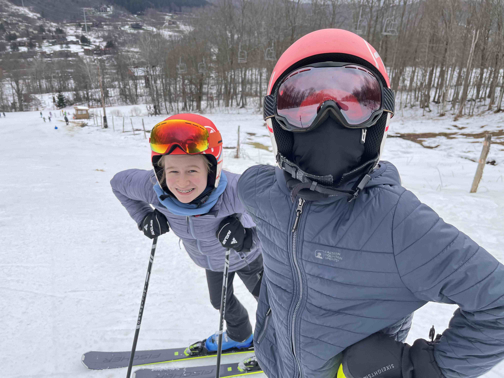
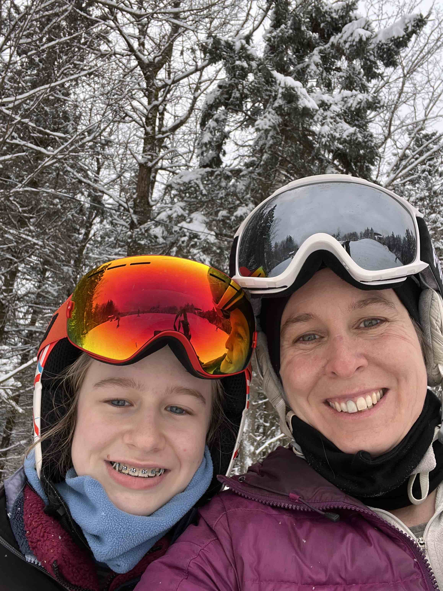
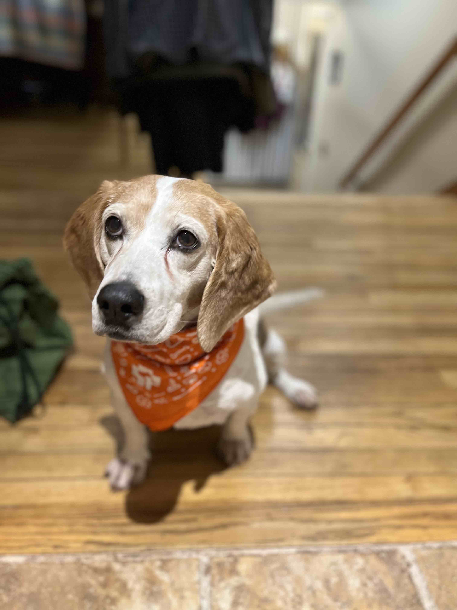
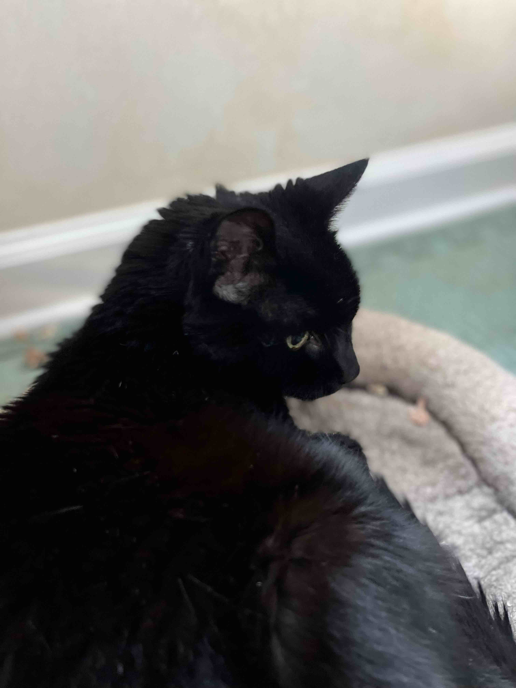

```{r setup, include=FALSE}
knitr::opts_chunk$set(echo = TRUE)
```

## All about Bronwyn

-   I am the lab manager of the Fuller Evolutionary Biology Lab at the Cornell Lab of Ornithology. [Lab website](https://lovette.eeb.cornell.edu/)

-   I am originally from Cape Town, South Africa.

    <center>

    

-   In the winter I like to spend time skiing with my family

    <center>

    {width="200"}{width="112"}

-   Our pets include Gopher (our beagle/basset), Mojo (the old lady cat of the house), 6 ducks and a couple of guinea pigs!

    <center>

    {width="200"}{width="200"}{width="200"}
