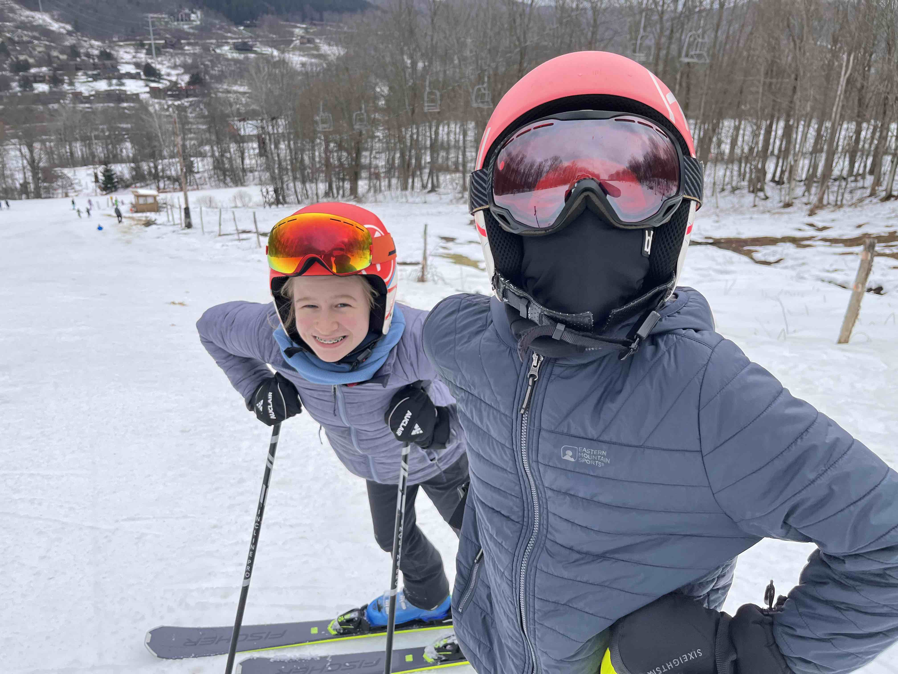
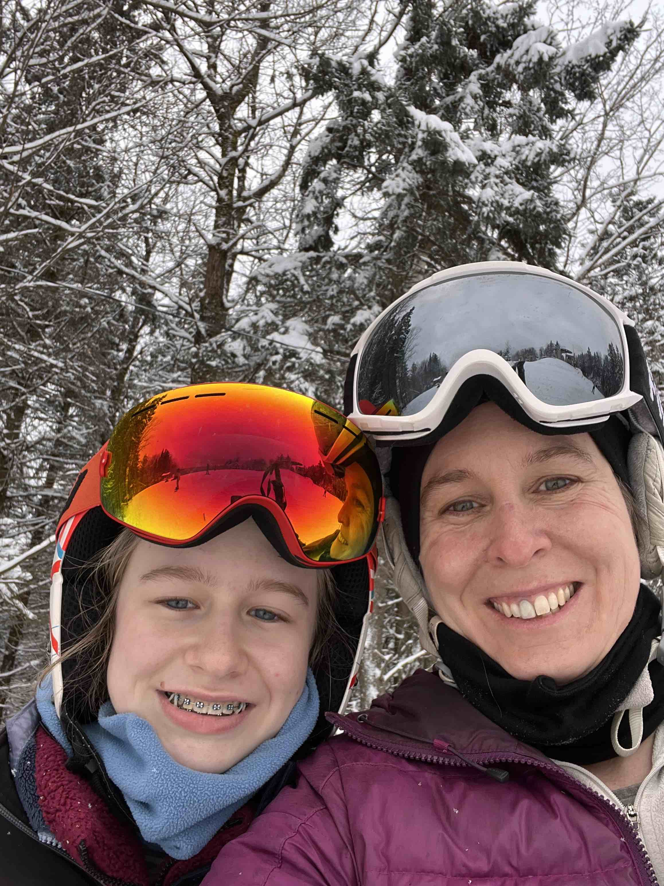

 

## Our Github Accounts 

Bronwyn's Github: https://github.com/bronwynbutcher
 
Sarah's Github: https://github.com/slawhun

 

## Here's a hedgehog

 

{width=70%}

 

## About Sarah

 

* I'm a freshwater ecologist from the Chicago area and I love the Great Lakes. Lake Michigan is my current study system.

 

{width=40%}

 

* When I'm not out on the lakes, I love mushroom foraging, sewing historical costumes, knitting, making soup, hiking, and hanging out with my friends and/or cats.

 

{width=30%}
{width=25%}
{width=35%}

 

* My current study organism is a tiny freshwater shrimp called *Mysis diluviana* and I am working with 20 years of data for this animal in the Great Lakes. They're an essential component of the pelagic food web in the lakes and perform diel vertical migration, migrating to the benthos (lakebed) during the day and swimming near the surface of the water at night. Here's a picture of the little guys.

 

{width=35%}

 

## About Bronwyn

-   I am the lab manager of the Fuller Evolutionary Biology Lab at the Cornell Lab of Ornithology. [Lab website](https://lovette.eeb.cornell.edu/)

-   I am originally from Cape Town, South Africa.

    

    

-   In the winter I like to spend time skiing with my family.

    

    {width="200"}{width="112"}

-   Our pets include Gopher (our beagle/basset), Mojo (the old lady cat of the house), 6 ducks and a couple of guinea pigs!

    

    {width="200"}{width="200"}{width="200"}

